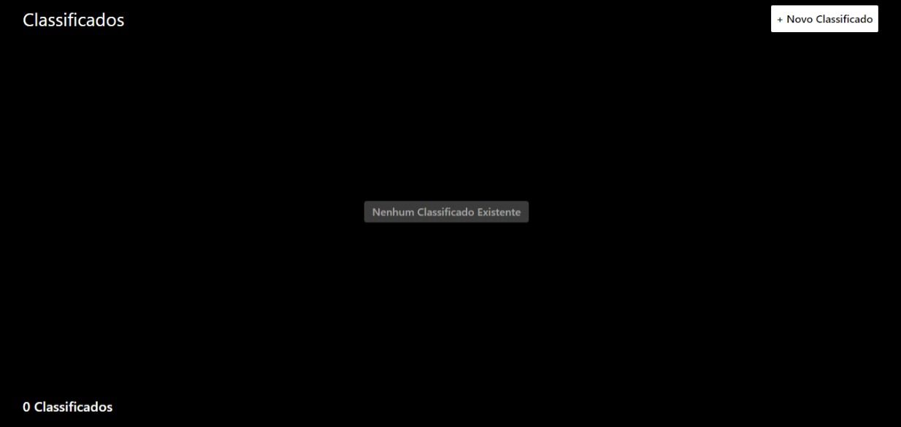
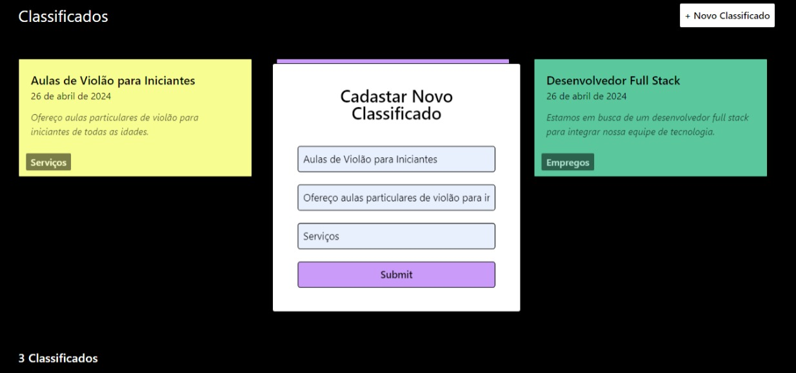
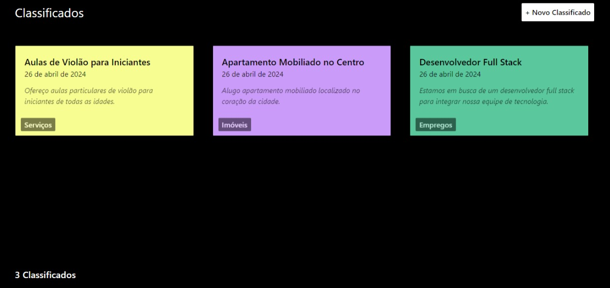

# Projeto de Classificados Online

Este é um projeto de uma aplicação web para exibir classificados online, permitindo que os usuários visualizem e criem novos classificados. A aplicação foi desenvolvida utilizando React para o frontend e Node.js com Express para o backend. Além disso, foram utilizadas as seguintes tecnologias:

- Tailwind CSS para estilização responsiva e fácil personalização.
- Framer Motion para adicionar animações interativas aos elementos da interface.
- Axios para realizar requisições HTTP entre o frontend e o backend.

## Funcionalidades

- Exibição de classificados em ordem de cadastro, com os mais recentes primeiro.
- Formulário para criação de novos classificados, com campos para título, descrição e a data é preenchida pelo backend.
- Validação no backend para garantir que os campos obrigatórios (título e descrição) sejam preenchidos.

## Estrutura do Projeto

O projeto foi organizado em duas pastas principais: `frontend` e `backend`, seguindo uma abordagem de separação de responsabilidades entre o frontend e o backend. A escolha por essa estrutura foi feita para facilitar a manutenção e escalabilidade da aplicação, além de permitir uma melhor organização do código.

- **Frontend**: Contém todos os arquivos relacionados ao frontend da aplicação, incluindo componentes React, estilos CSS, e arquivos de configuração. O frontend foi desenvolvido utilizando React.js, Tailwind CSS e Framer Motion.

- **Backend**: Responsável por lidar com as requisições dos clientes, processar dados e fornecer respostas. Utiliza Node.js com Express para criar e gerenciar o servidor da aplicação.






## Executando o Projeto

Para iniciar o servidor backend e o frontend simultaneamente, execute o seguinte comando na pasta `backend`:

```bash
npm run dev
